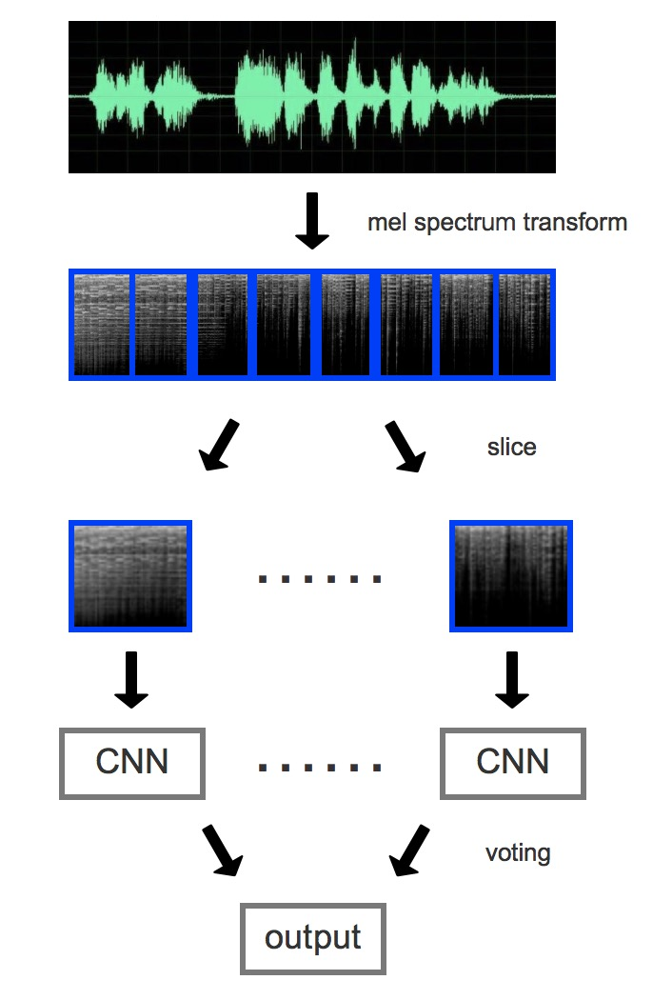

# WWW-Music-Genre-Recognition-Challenge

这是[WWW-Music-Genre-Recognition-Challenge](https://www.crowdai.org/challenges/www-2018-challenge-learning-to-recognize-musical-genre  )的第五名实现源码：  
团队成员@AlgoHunt @viperit
整个模型流程如下图所示


## Dependencies
+ Python 3; TensorFlow >= 1.3.0
+ FMA data. 请按如下结构存放:
```
DIR/
  fma_medium/
  crowdai_fma_test/
  save/
```
+ [训练数据](https://os.unil.cloud.switch.ch/fma/fma_medium.zip)共25000样本，大约有100个以下没有声音或者损坏，请注意清洗  .
+ [测试数据](https://os.unil.cloud.switch.ch/fma/fma_crowdai_www2018_test.tar.gz)35000，也有一小部分损坏.  
+ [元数据](https://os.unil.cloud.switch.ch/fma/fma_metadata.zip)我们已经将元数据转化为更易使用的格式，如有需要请自行修改.

## Usage
GPU：P100，CPU：6核，大约20分钟1000step，训练速率以及其他设置请参看代码  
一般训练到21000步为最好，训练到dev有67%，train有90+，反而在榜上表现较好  

CNN-Run：主调用过程，如果save中有模型，会自动读取restore模型，继续训练    
preprocess：存图、切分图、分成train、dev、test，分别制作TFrecord  
prediction：预测test集，给出最后的结果prediction-softmax.csv，注意最好重新按照大小排序   
xception：xception network 实现
